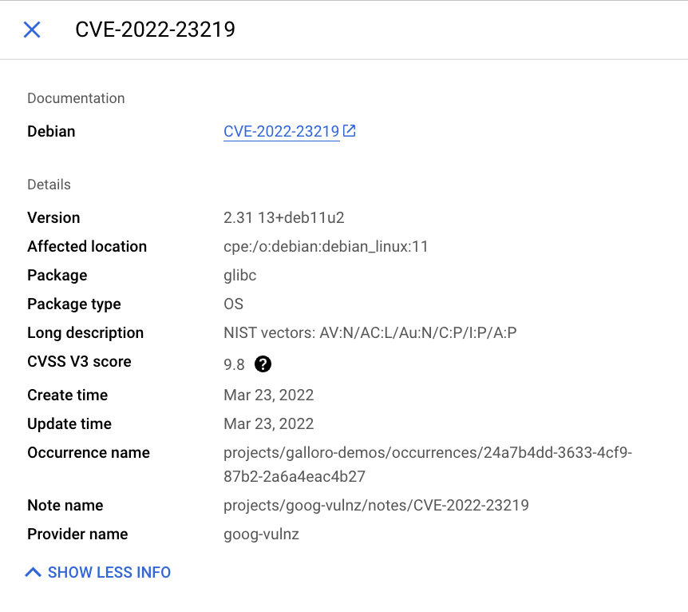
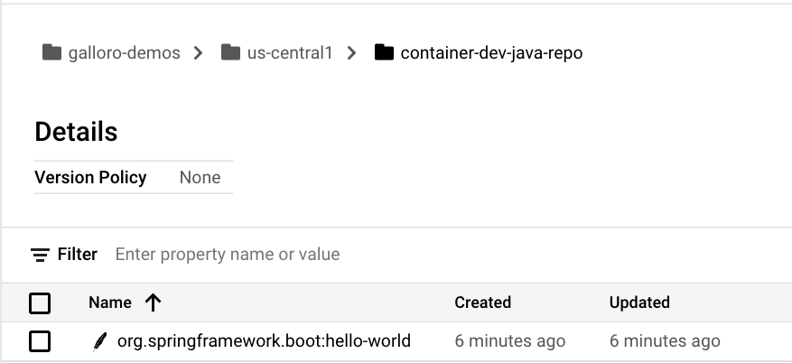

# Working with Artifact Registry lab step
Artifact Registry is a single place to manage container images and language packages, and is fully integrated with Google Cloud tooling and and runtimes. This makes it simple to integrate it with your CI/CD tooling to set up automated pipelines

# Task 1. Prepare environment

Set up variables  
* In Cloud Shell, set your project ID and project number. Save them as PROJECT_ID and PROJECT_NUMBER variables:  
      
```
export PROJECT_ID=$(gcloud config get-value project)
export PROJECT_NUMBER=$(gcloud projects describe $PROJECT_ID --format='value(projectNumber)')
export REGION="REGION"
gcloud config set compute/region $REGION
```

Enable Google services  
Run the following to enable necessary Google services:

```
gcloud services enable \
  cloudresourcemanager.googleapis.com \
  container.googleapis.com \
  artifactregistry.googleapis.com \
  containerregistry.googleapis.com \
  containerscanning.googleapis.com
```

Get the source code
The source code for this lab is located in the GoogleCloudPlatform org on GitHub.

Clone the source code with the command below, then change into the directory.  

```
git clone https://github.com/GoogleCloudPlatform/cloud-code-samples/
cd ~/cloud-code-samples
```

Provision the infrastructure used in this lab
In this lab you will deploy code to Kubernetes Engine (GKE).

Run the setup script below to prepare this infrastructure:

```
gcloud container clusters create container-dev-cluster --zone="ZONE"
```

# Task 2. Working with container images

Create a Docker Repository on Artifact registry  
Artifact Registry supports managing container images and language packages. Different artifact types require different specifications. For example, the requests for Maven dependencies are different from requests for Node dependencies.  

To support the different API specifications, Artifact Registry needs to know what format you want the API responses to follow. To do this you will create a repository and pass in the --repository-format flag indicating the type of repository desired.  

From Cloud Shell run the following command to create a repository for Docker images:  

```
gcloud artifacts repositories create container-dev-repo --repository-format=docker \
  --location=$REGION \
  --description="Docker repository for Container Dev Workshop"
```


Click Authorize if the Cloud Shell authorization prompt appears.

In the Cloud console, go to Artifact Registry > Repositories and notice your newly created Docker repository named container-dev-repo. If you click on it you can see that it's empty at the moment.

Configure Docker Authentication to Artifact Registry
When connecting to Artifact Registry credentials are required in order to provide access. Rather than set up separate credentials, Docker can be configured to use your gcloud credentials seamlessly.

From Cloud Shell run the following command to configure Docker to use the Google Cloud CLI to authenticate requests to Artifact Registry in the <filled in at lab start> region:

```
gcloud auth configure-docker "Filled in at lab start"-docker.pkg.dev
```

The command will prompt for a confirmation to change the Cloud Shell docker configuration, click ENTER.
  
Explore the sample Application
A sample application is provided in the git repository you cloned.

Change into the java directory and review the application code:

```
cd ~/cloud-code-samples/java/java-hello-world
```
The folder contains an example Java application that renders a simple web page: in addition to various files not relevant for this specific lab, it contains the source code, under the src folder, and a Dockerfile you will use to build a container image locally.

Build the Container Image
Before you can store container images in Artifact Registry you need to create one.

Run the following command to build the container image and tag it properly:

```
docker build -t "REGION"-docker.pkg.dev/"PROJECT_ID"/container-dev-repo/java-hello-world:tag1 .
```

Push the Container Image to Artifact Registry
Run the following command to push the container image to the repository you created:
  
```
docker push "REGION"-docker.pkg.dev/"PROJECT_ID"/container-dev-repo/java-hello-world:tag1
```


Review the image in Artifact Registry
In Artifact Registry > Repositories, click into container-dev-repo and check that the java-hello-world image is there.

Click on the image and note the image tagged tag1. You can see that Vulnerability Scanning is running or already completed and the number of vulnerabilities detected is visible.
  
  

  
  
Click on the number of vulnerabilities and you will see the list of vulnerabilities detected in the image, with the CVE bulletin name and the severity. Click VIEW on each listed vulnerability to get more details:
  
  

  
  
# Task 3. Integration with Cloud Code

In this section you use the Artifact Registry Docker image repository with Cloud Code.

Deploy the Application to GKE Cluster from Cloud Code
1. From the java-hello-world folder run the following command to open Cloud Shell Editor and add the application folder to this workspace:
  
```
cloudshell workspace .
```
  
The Cloud Shell editor will open with the explorer in the application folder.

2. If you get a pop-up asking to exclude Java project settings files from the workspace, click on Exclude in workspace .

3. The following steps will require you to enter your Artifact Registry repository location. The format for the location is:

```
"REGION"-docker.pkg.dev/"PROJECT_ID"/container-dev-repo
```

Click on the Cloud Code status bar (in the lower left corner) and then select Run on Kubernetes:


  
4. When prompted choose Yes to use the current context in kubeconfig that points to the container-dev-cluster GKE cluster provisioned for the lab.

5. If Prompted for a Skaffold configuration, choose the java/java-hello-world project and choose to build via Dockerfile.

6. If Prompted for a context, select Yes to use the current context.

7. In the prompt for the image registry choose to specify a location and put the address location you located before ensuring to substitute $REGION and <PROJECT_ID> for your actual value:
  
```
"REGION"-docker.pkg.dev/"PROJECT_ID"/container-dev-repo
```
  
8. When you execute Run on Kubernetes for the first time Cloud Code prompts you for the target image repository location. Once provided, the repository url is stored in the file .vscode/launch.json which is created in the application folder.

In the output pane you see that the build starts for the application image java-hello-world, the image is uploaded to the Artifact Registry repository configured previously.

9. In Artifact Registry > Repositories click into container-dev-repo and check that the java-hello-world image and note a new image tagged latest.


Review the Deployed Application
1. Go back to Cloud Shell Editor. When deployment is complete Skaffold/Cloud Code will print the exposed url where the service have been forwarded, click on the link - Open Web Preview:
  
In the new browser window you see the hello world app page.
  
Update application code
  
Now update the application to see the change implemented immediately in the deployment on the cluster:

1. Open the HelloWorldController.java in src/main/java/cloudcode/helloworld/web folder in Cloud Shell Editor.

2. Change the text in row 20 from "It's running!" to "It's updated!". You should see the build and deployment process starting immediately.

3. At the end of the deploy click again on the forwarded url or refresh the browser window with the application to see your change deployed:

4. In the Cloud console go to Navigation Menu > Artifact Registry > Repositories and click into container-dev-repo to check that the java-hello-world image and note the new image.
  
  
# Task 4. Working with language packages

In this section you will set up an Artifact Registry Java repository and upload packages to it, leveraging them in different applications.

Create a Java package repository
  
1. From Cloud Shell run the following command to create a repository for Java artifacts:

```
gcloud artifacts repositories create container-dev-java-repo \
    --repository-format=maven \
    --location="REGION" \
    --description="Java package repository for Container Dev Workshop"
```

2. Click Authorize if the Cloud Shell authorization prompt appears

3. In the Cloud console go to Artifact Registry > Repositories and notice your newly created Maven repository named container-dev-java-repo, if you click on it you can see that it's empty at the moment.
  
Set up authentication to Artifact Repository
Use the following command to update the well-known location for Application Default Credentials (ADC) with your user account credentials so that the Artifact Registry credential helper can authenticate using them when connecting with repositories:

gcloud auth login --update-adc


If prompted to authenticate:

Choose Y.

Paste the code into a browser window.

Select Google Sign In and sign in using the credentials in the lab.

Copy the authentication code from the browser back into the console to complete the authentication.

1. Configure Maven for Artifact Registry
Run the following command to print the repository configuration to add to your Java project:

```
gcloud artifacts print-settings mvn \
  --repository=container-dev-java-repo \
  --location="REGION"
```

2. Open the pom.xml in Cloud Shell Editor and add the returned settings to the appropriate sections in the file:

Add the distributionManagement section

```
<distributionManagement>
  <snapshotRepository>
    <id>artifact-registry</id>
    <url>artifactregistry://"REGION"-maven.pkg.dev/"PROJECT_ID"/container-dev-java-repo</url>
  </snapshotRepository>
  <repository>
    <id>artifact-registry</id>
    <url>artifactregistry://"REGION"-maven.pkg.dev/"PROJECT_ID"/container-dev-java-repo</url>
  </repository>
</distributionManagement>
```
  
Add the repositories section

  
```
<repositories>
 <repository>
   <id>artifact-registry</id>
   <url>artifactregistry://"REGION"-maven.pkg.dev/"PROJECT_ID"/container-dev-java-repo</url>
   <releases>
     <enabled>true</enabled>
   </releases>
   <snapshots>
     <enabled>true</enabled>
   </snapshots>
 </repository>
</repositories>
```

  
Update the extensions in the Builds section

   
```
<extensions>
   <extension>
     <groupId>com.google.cloud.artifactregistry</groupId>
     <artifactId>artifactregistry-maven-wagon</artifactId>
     <version>2.1.0</version>
   </extension>
 </extensions>
```
  
Here's an example of the complete file for your reference. Ensure to replace <PROJECT> with your project id.
  
```
<?xml version="1.0" encoding="UTF-8"?>
<project xmlns="http://maven.apache.org/POM/4.0.0" xmlns:xsi="http://www.w3.org/2001/XMLSchema-instance"
       xsi:schemaLocation="http://maven.apache.org/POM/4.0.0 http://maven.apache.org/xsd/maven-4.0.0.xsd">
 <modelVersion>4.0.0</modelVersion>
 <artifactId>hello-world</artifactId>
 <packaging>jar</packaging>
 <name>Cloud Code Hello World</name>
 <description>Getting started with Cloud Code</description>
 <version>1.0.0</version>
<distributionManagement>
   <snapshotRepository>
     <id>artifact-registry</id>
     <url>artifactregistry://"REGION"-maven.pkg.dev/"PROJECT_ID"/container-dev-java-repo</url>
   </snapshotRepository>
   <repository>
     <id>artifact-registry</id>
     <url>artifactregistry://"REGION"-maven.pkg.dev/"PROJECT_ID"/container-dev-java-repo</url>
   </repository>
 </distributionManagement>
 <repositories>
   <repository>
     <id>artifact-registry</id>
     <url>artifactregistry://"REGION"-maven.pkg.dev/"PROJECT_ID"/container-dev-java-repo</url>
     <releases>
       <enabled>true</enabled>
     </releases>
     <snapshots>
       <enabled>true</enabled>
     </snapshots>
   </repository>
 </repositories>
 <parent>
   <groupId>org.springframework.boot</groupId>
   <artifactId>spring-boot-starter-parent</artifactId>
   <version>2.6.3</version>
 </parent>
 <properties>
   <java.version>1.8</java.version>
   <checkstyle.config.location>./checkstyle.xml</checkstyle.config.location>
 </properties>
 <build>
   <plugins>
     <plugin>
       <groupId>com.google.cloud.tools</groupId>
       <artifactId>jib-maven-plugin</artifactId>
       <version>3.2.0</version>
     </plugin>
     <plugin>
       <groupId>org.springframework.boot</groupId>
       <artifactId>spring-boot-maven-plugin</artifactId>
     </plugin>
     <plugin>
       <groupId>org.apache.maven.plugins</groupId>
       <artifactId>maven-checkstyle-plugin</artifactId>
       <version>3.1.2</version>
     </plugin>
   </plugins>
   <extensions>
     <extension>
       <groupId>com.google.cloud.artifactregistry</groupId>
       <artifactId>artifactregistry-maven-wagon</artifactId>
       <version>2.1.0</version>
     </extension>
   </extensions>
 </build>
 <!-- The Spring Cloud GCP BOM will manage spring-cloud-gcp version numbers for you. -->
 <dependencyManagement>
   <dependencies>
     <dependency>
       <groupId>org.springframework.cloud</groupId>
       <artifactId>spring-cloud-gcp-dependencies</artifactId>
       <version>1.2.8.RELEASE</version>
       <type>pom</type>
       <scope>import</scope>
     </dependency>
   </dependencies>
 </dependencyManagement>
 <dependencies>
   <dependency>
     <groupId>org.springframework.boot</groupId>
     <artifactId>spring-boot-starter</artifactId>
   </dependency>
   <dependency>
     <groupId>org.springframework.boot</groupId>
     <artifactId>spring-boot-starter-jetty</artifactId>
   </dependency>
   <dependency>
     <groupId>org.springframework</groupId>
     <artifactId>spring-webmvc</artifactId>
   </dependency>
   <dependency>
     <groupId>org.springframework.boot</groupId>
     <artifactId>spring-boot-starter-thymeleaf</artifactId>
   </dependency>
   <dependency>
     <groupId>org.springframework.boot</groupId>
     <artifactId>spring-boot-starter-test</artifactId>
     <scope>test</scope>
   </dependency>
   <dependency>
     <groupId>org.springframework.cloud</groupId>
     <artifactId>spring-cloud-gcp-starter-logging</artifactId>
   </dependency>
 </dependencies>
</project>
```
 
Upload your Java package to Artifact Registry
With Artifact Registry configured in Maven, you can now use Artifact Registry to store Java Jars for use by other projects in your organization.

Run the following command to upload your Java package to Artifact Registry:

```
mvn deploy

```

Check the Java package in Artifact Registry
  
In the Cloud console go to Artifact Registry > Repositories and click into container-dev-java-repo to check that the hello-world binary artifact is there:

  



